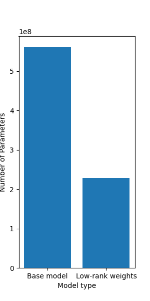
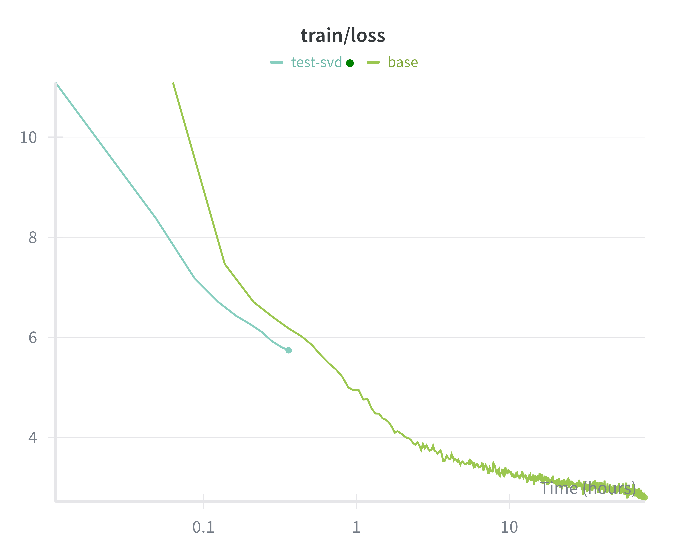

# Increasing LLM Efficiency Through Parameter Approximation

Training LLMs takes a significant amount of resources. Here we explore training LLMs using low-rank weight initialization to understand their performance tradeoffs.

## Research goal

We aim to reduce LLM pre-training costs by training models with low-rank weight matrices from initialization. The core question is whether language models can be effectively pre-trained within a low-rank weight manifold, and if so, what trade-offs exist between rank, depth, and final model performance. When performance gaps exist, can increased model depth compensate for reduced rank at fixed parameter budgets?

## Significance

This research is beneficial in multiple ways:
1. Training a foundational language model can cost $100 million-$1 billion, training for up to 6 months at a time. Reducing the time it takes to train a model by even %10 can lead to weeks and millions saved, leading to faster research and production iteration cycles.
2. There is a relationship between parameter count and model depth when it comes to expressiveness. It’s possible that the expressiveness of the model increases more over depth than over parameters (i.e., increasing rank) within a layer. If this hypothesis holds true, it could indicate that LLMs could improve generalization through low-rank regularization, yet maintain expressiveness through increasing model depth.
3. Existing research has shown that LLM weights can be well-approximated with their low-rank counterparts (i.e., LORA). However, it is unclear if it is possible to train a model within the low-rank manifold. Understanding this question can lead to broad theoretical implications for model efficiency.

## Approach

### Prereq’s

We will adapt Karpathy’s `nanochat` [repository](https://github.com/wingillis/layerwise-llm-training/tree/add-layered-gpt) for running our experiments.
This repository was built as a learning tool for those interested with training their own small scale chatbot. The training and model setup scripts are highly valuable as a starting point, as they contain setup, fitting loops, and validation functions.

Our **baseline model** is defined a a full-rank model with a fixed depth (i.e., d=20) and embedding dimension (i.e., dim=1024).

### Hypotheses

- The weight matrices of linear layers of an LLM can be well-approximated with low-rank matrices during training, reducing memory and training latency compared to the baseline model.
- Approximating weight matrices in both the attention layers and MLP embedding layers are beneficial to training performance and don't impact model perplexity too significantly.
- A deeper low-rank network with the same number of parameters as a baseline network should have a lower perplexity than the baseline model after training.

### Core results

We aim to show that pre-training a language model using low-rank approximations for the linear layer weights suffers only minor performance hits compared to a full-rank baseline model – the standard nanoGPT model – with the same architecture. We will benchmark the effect of multiple parameters on the outcome of model pre-training.

The core output variables are:
- **perplexity** (performance; lower is better)
- **time** to reach a threshold perplexity value
- model **parameter count**
- **memory** consumption

We will measure the core output variables while varying:
- learning rate
- the rank of the approximated weight layers
	- vary the rank of the MLP layers and attention layers separately
- model depth
Each parameter will be scanned individually at first, and depending on the results, multiple sets of parameters will be combined in following scans. The parameter sweeps will find the Pareto frontier of rank vs perplexity. 

If we find that low-rank models plateau at significantly higher perplexity regardless of depth, then that tells us full-rank weight matrices are likely more expressive than increasing depth alone.

#### Stretch goal

Research shows that in post-training, low-rank weight estimation performed adaptively across layers performs well. We will test varying rank across layers using a few simple functions: linear, step, exponential, and negative quadratic with the goal of finding a configuration that.

## Timeline

1 week for benchmarking
2 weeks for parameter sweeps
1 week for write-up

## Preliminary data

Figure 1. Total parameter counts for the base model (left) and low-rank weight model (right). The low-rank weight model contains fewer than 50% the parameter count of the base model.

Figure 2. Cross-entropy loss curves for the base (green) model, and the low-rank weight (blue) model over time. The low-rank weight model achieves a loss of 6 2x faster than the base model. Each model has the same depth (d=20) and embedding dimension (dim=1024). In this example, it is expected that the low-rank model plateaus at a higher loss.

## Next steps

1. Clean up codebase, remove fluff.
2. Benchmark individual layers to understand their baseline memory and computation performance
3. Turn the training loop into a batch job to scan over the parameters mentioned above 
